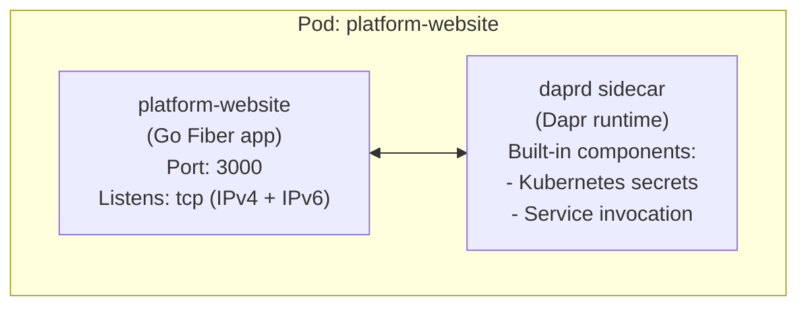
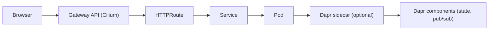

# RezusCloud Platform Website

The official landing page for the RezusCloud Enterprise Kubernetes Platform, built with Go Fiber, templ, HTMX, and Tailwind CSS, running on the Dapr runtime.

## Overview

This is a single-page marketing website that showcases the RezusCloud Kubernetes platform. The site features:

- **Single-page scrolling layout** with 11 content sections
- **Dark/light theme toggle** with localStorage persistence
- **Alpine.js** focuses on client-side interactivity (theme, mobile menu)
- **HTMX** focuses on server-side interactivity (section updates)
- **Progressive enhancement** - works without JavaScript, enhanced with it
- **Dapr sidecar integration** for microservices building blocks
- **Multi-architecture container images** (amd64/arm64)

## Tech Stack

| Category | Technology | Version |
|----------|------------|---------|
| Runtime | Go | 1.24 |
| Web Framework | Fiber v2 | 2.52.6 |
| Templating | templ | 0.3.1001 |
| CSS Framework | Tailwind CSS | 4.1.0 |
| Server Interactivity | HTMX | 2.0.6 |
| Client State | Alpine.js | 3.x |
| Container Runtime | Dapr | 1.15.3 |
| Base Image | distroless/static-debian12 | nonroot |

## Architecture

### Application Architecture



### Request Flow



### Project Structure

```
platform-website/
├── main.go                     # Application entry point
├── go.mod                      # Go module definition
├── go.sum                      # Go dependencies lock
├── input.css                   # Tailwind CSS entry point
├── package.json                # npm scripts for Tailwind CLI
├── Dockerfile                  # Multi-stage container build
├── Makefile                    # Build automation commands
├── README.md                   # This file
├── AGENTS.md                   # Guidelines for AI coding agents
├── .github/
│   └── workflows/
│       └── ci.yml              # GitHub Actions CI/CD
├── handlers/
│   ├── pages.go                # HTTP handlers (Home, Section)
│   └── api.go                  # API handlers (Version)
├── version/
│   └── version.go              # Version info (injected at build)
├── views/
│   ├── layout.templ            # Base HTML layout, Nav, Footer
│   ├── layout_templ.go         # Generated Go code
│   ├── components/             # Reusable components (placeholder)
│   ├── pages/
│   │   ├── home.templ          # Home page composition
│   │   └── home_templ.go       # Generated Go code
│   └── sections/
│       ├── hero.templ
│       ├── challenge.templ
│       ├── architecture.templ
│       ├── features.templ
│       ├── networking.templ
│       ├── edge.templ
│       ├── services.templ
│       ├── comparison.templ
│       ├── usecases.templ
│       ├── techstack.templ
│       └── getstarted.templ
├── assets/
│   ├── js/
│   │   ├── htmx.min.js         # Vendored HTMX 2.0.6
│   │   └── alpine.min.js       # Vendored Alpine.js 3.x
│   ├── img/
│   │   ├── icon.svg            # SVG favicon
│   │   ├── favicon.ico         # ICO favicon
│   │   ├── apple-touch-icon.png
│   │   ├── icon-192.png        # PWA icon
│   │   └── icon-512.png        # PWA icon
│   ├── manifest.webmanifest    # PWA manifest
│   └── styles.css              # Generated Tailwind CSS (gitignored)
└── tests/
    ├── integration_test.go     # Layer 2: goquery tests
    └── e2e_test.go             # Layer 3: chromedp tests
```

## Design Decisions

### 1. Go Fiber over net/http

Fiber provides excellent performance with its fasthttp foundation and offers a clean API for middleware composition. The middleware stack includes:

- `recover.New()` - Panic recovery
- `logger.New()` - Request logging
- `compress.New()` - Response compression

### 2. templ over html/template

templ offers type-safe HTML templating with Go code generation, eliminating runtime template errors and providing IDE support. Unlike `html/template`, templ:

- Generates Go code at build time
- Catches template errors during compilation
- Provides proper IDE autocompletion
- Enables component-based architecture

### 3. Tailwind CSS v4 with class strategy

The dark mode uses Tailwind's `class` strategy (not `media`) for explicit theme control:

```css
@custom-variant dark (&:where(.dark, .dark *));
```

Theme is managed by adding/removing the `dark` class on `<html>` and persisted to localStorage.

### 4. HTMX for Progressive Enhancement

The application supports both full-page renders and partial section updates:

| Route | Handler | Description |
|-------|---------|-------------|
| `GET /` | `handlers.Home` | Full page with all sections |
| `GET /sections/:name` | `handlers.Section` | Individual section for HTMX swaps |
| `GET /api/version` | `handlers.APIVersion` | JSON with version, gitCommit, buildTime |
| `GET /manifest.webmanifest` | Static file | PWA manifest |

This enables future enhancements like lazy-loading sections or animated transitions.

### 5. Dual-stack Network Listening

The server uses `net.Listen("tcp", ":3000")` instead of `tcp6` to listen on both IPv4 and IPv6:

```go
ln, err := net.Listen("tcp", addr)
```

This is required because Dapr sidecar communicates with the app via localhost (IPv4), while cluster traffic uses IPv6.

### 6. Dapr Runtime Integration

The application runs with Dapr sidecar injection for microservices capabilities:

**Annotations applied:**
```yaml
dapr.io/enabled: "true"
dapr.io/app-id: "platform-website"
dapr.io/app-port: "3000"
dapr.io/continue-on-failed-component-init: "true"
```

The `continue-on-failed-component-init` annotation allows Dapr to start even when the built-in Kubernetes secret store fails (occurs in distroless containers without kubeconfig).

### 7. Multi-stage Docker Build

The Dockerfile uses three stages for optimal image size:

1. **tailwind** (node:22-alpine) - Builds minified CSS
2. **builder** (golang:1.24-alpine) - Generates templ and compiles Go binary
3. **production** (distroless/static-debian12:nonroot) - Minimal runtime

Final image size: ~15MB

### 8. Distroless Base Image

Using `gcr.io/distroless/static-debian12:nonroot` provides:

- Minimal attack surface (no shell, package manager)
- Reduced CVE exposure
- Non-root execution by default
- Compatible with static Go binaries

## Content Sections

The website consists of 11 sections, each as a separate templ component:

| Section | ID | Purpose |
|---------|-----|---------|
| Hero | `#hero` | Main headline, CTA, key stats |
| Challenge | `#challenge` | Industry problem statement |
| Architecture | `#architecture` | Three-tier platform diagram |
| Features | `#features` | Core capabilities grid |
| Networking | `#networking` | Cilium, WireGuard, dual-stack |
| Edge | `#edge` | Baremetal edge computing |
| Services | `#services` | Managed platform services |
| Comparison | `#comparison` | Cost comparison table |
| Use Cases | `#usecases` | Industry applications |
| Tech Stack | `#techstack` | Technology components |
| Get Started | `#getstarted` | Quick start guide |

## Development

### Prerequisites

- Go 1.24+
- Node.js 22+
- templ CLI (`go install github.com/a-h/templ/cmd/templ@latest`)

### Local Development

```bash
# Install dependencies
npm install

# Download vendored JS libraries (HTMX, Alpine.js)
make vendor

# Generate templ files
templ generate

# Build CSS
npm run build:css

# Run the server
go run .
```

### Watch Mode

```bash
# Terminal 1: Watch CSS changes
npm run watch:css

# Terminal 2: Watch templ changes
templ generate --watch

# Terminal 3: Run server
go run .
```

### Building

```bash
# Generate all
templ generate
npm run build:css

# Build binary
CGO_ENABLED=0 go build -o bin/server .
```

### Docker Build

```bash
docker build -t platform-website .
docker run -p 3000:3000 platform-website
```

**Build Arguments:**

| Argument | Default | Description |
|----------|---------|-------------|
| `VERSION` | `dev` | Application version (e.g., `1.0.0`) |
| `GIT_COMMIT` | `unknown` | Git commit hash |
| `BUILD_TIME` | `unknown` | Build timestamp |

```bash
docker build \
  --build-arg VERSION=1.0.0 \
  --build-arg GIT_COMMIT=$(git rev-parse HEAD) \
  --build-arg BUILD_TIME=$(date -u +%Y-%m-%dT%H:%M:%SZ) \
  -t platform-website .
```

## CI/CD Pipeline

### GitHub Actions Workflow

The CI pipeline (`.github/workflows/ci.yml`) runs on:

- Push to `master` branch
- Pull requests to `master`

**Build Stage:**
1. Set up Go 1.24
2. Set up Node.js 22
3. Install templ CLI
4. Generate templ files
5. Format check (templ and Go)
6. Run `go vet`
7. Build CSS
8. Build binary

**Docker Stage (master only):**
1. Log in to GitHub Container Registry
2. Extract metadata (SHA tag + latest)
3. Build multi-arch image (amd64, arm64)
4. Push to `ghcr.io/rezuscloud/platform-website`
5. Set package visibility to public

### Container Registry

Images are published to:
```
ghcr.io/rezuscloud/platform-website:latest
ghcr.io/rezuscloud/platform-website:<sha>
```

## Kubernetes Deployment

### Infrastructure

The website is deployed via Terraform module in `k8s-iac/modules/platform-website/`:

```hcl
module "platform_website" {
  source       = "./modules/platform-website"
  image        = "ghcr.io/rezuscloud/platform-website:latest"
  dapr_enabled = true
  dapr_app_id  = "platform-website"
}
```

### Resources Created

| Resource | Type | Purpose |
|----------|------|---------|
| Deployment | apps/v1 | 2 replicas with Dapr sidecar |
| Service | v1 | ClusterIP on port 3000 |
| HTTPRoute | gateway.networking.k8s.io/v1 | Gateway API routing |

### Gateway API Configuration

The HTTPRoute routes `rezus.cloud` to the platform-website service:

```yaml
spec:
  hostnames:
    - rezus.cloud
  rules:
    - backendRefs:
        - name: platform-website
          port: 3000
```

### Pod Security

When Dapr is enabled, the namespace uses `baseline` PodSecurity policy because the Dapr sidecar doesn't drop capabilities (required for `restricted` policy).

### Dapr Configuration

The Dapr control plane is deployed separately via `k8s-iac/modules/dapr/`:

- **Namespace:** `dapr-system`
- **Components:** Operator, Placement, Scheduler, Sentry, Sidecar Injector
- **HA Mode:** 3 replicas for scheduler

## Environment Variables

| Variable | Default | Description |
|----------|---------|-------------|
| `PORT` | `3000` | Server listen port |

## Key Implementation Notes

### Theme Persistence

Theme state is managed client-side:

1. On page load, check `localStorage.getItem('theme')`
2. If not set, detect `prefers-color-scheme` media query
3. Apply `dark` class to `<html>` element
4. Toggle updates localStorage and class

### Static Assets

Assets are served with `CacheDuration: -1` (no caching) to ensure fresh content during development. In production, the Gateway API can add cache headers.

### HTMX Integration

HTMX is vendored at `assets/js/htmx.min.js` to avoid external dependencies. Future enhancements could include:

- Lazy-loading sections on scroll
- Form submissions without page reload
- Real-time updates via SSE/WebSocket

### Version API

The `/api/version` endpoint returns build information:

```json
{
  "version": "1.0.0",
  "gitCommit": "abc123def456",
  "buildTime": "2024-01-15T10:30:00Z"
}
```

Version information is injected at build time via ldflags (see Docker Build section).

### Memory Footprint

The application has minimal memory overhead:

- Go binary: ~10MB
- Distroless base: ~2MB
- Total image: ~15MB
- Runtime memory: ~20-30MB

## License

MIT License - See LICENSE file for details.

## Contributing

1. Fork the repository
2. Create a feature branch
3. Make changes (run `templ generate` if modifying templates)
4. Submit a pull request

## Links

- **Live Site:** https://rezus.cloud
- **Source:** https://github.com/rezuscloud/platform-website
- **Container Registry:** https://github.com/rezuscloud/platform-website/pkgs/container/platform-website
- **Platform Documentation:** See `docs/PLATFORM.md` in the talos repository
