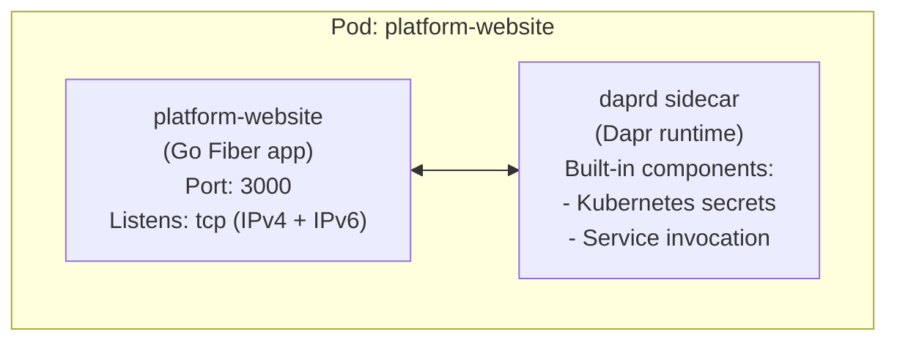
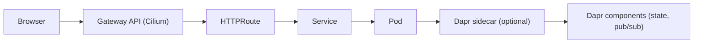

# RezusCloud Platform Website

The landing page for RezusCloud, your personal cloud. Built with Go Fiber, templ, HTMX, Alpine.js, and Tailwind CSS, running on the Dapr runtime.

## Overview

A single-page scrolling website presenting the **Personal Cloud** narrative: one person with any hardware and any ISP can run their own cloud infrastructure. The site draws the analogy from the personal computer revolution (mainframes to PCs) to today (cloud providers to personal cloud).

The visual design inhabits two eras of computing revolution by the same visionary:
- **Day mode**: Mac System 1 (1984), stark black on white, 1px flat borders, bitmap textures, amber gold accent
- **Night mode**: NeXTSTEP (1988), deep black, 2px beveled edges, CRT scanlines, pure grayscale

Key features:
- **Dual-era theme** toggled via Alpine.js, persisted to localStorage
- **Animated page experience**: staggered hero entrance, terminal boot typewriter, scroll-triggered section reveals, CRT flicker on theme switch
- **Progressive enhancement**: works without JavaScript, enhanced with it
- **Dapr sidecar integration** for microservices building blocks
- **Multi-architecture container images** (amd64/arm64)

## Design System

The visual design system is documented in separate files:

| File | Purpose |
|------|---------|
| [`PRODUCT.md`](PRODUCT.md) | Brand strategy, personality, users, anti-references, design principles |
| [`DESIGN.json`](DESIGN.json) | Color tokens, font tokens, border strategies, utilities, animation specs |

All color, font, border, and animation tokens live in `input.css` under the `@theme` block. The `@utility` blocks define mode-specific effects (bevels, scanlines, Mac textures).

**Key rules**: Zero border-radius everywhere. Mac mode uses 1px flat borders. NeXT mode uses 2px beveled edges. Fonts are consistent across modes (Silkscreen headings, system-ui body, VT323 terminal). Only colors change between light and dark.

## Tech Stack

| Category | Technology | Version |
|----------|------------|---------|
| Runtime | Go | 1.24+ |
| Web Framework | Fiber v2 | 2.52.6 |
| Templating | templ | latest |
| CSS Framework | Tailwind CSS | v4 |
| Server Interactivity | HTMX | 2.0.6 |
| Client State | Alpine.js | 3.x |
| Fonts | Silkscreen, VT323 | self-hosted woff2 |
| Container Runtime | Dapr | 1.15.3 |
| Base Image | distroless/static-debian12 | nonroot |

## Architecture

### Application Architecture



### Request Flow



### Project Structure

```
platform-website/
├── main.go                     # Application entry point
├── go.mod                      # Go module definition
├── go.sum                      # Go dependencies lock
├── input.css                   # Tailwind CSS entry point + @theme tokens
├── package.json                # npm scripts for Tailwind CLI
├── Dockerfile                  # Multi-stage container build
├── Makefile                    # Build automation commands
├── README.md                   # This file
├── PRODUCT.md                  # Brand strategy and design principles
├── DESIGN.json                 # Design system token reference
├── AGENTS.md                   # Guidelines for AI coding agents
├── .github/
│   └── workflows/
│       ├── ci.yml              # GitHub Actions CI/CD
│       ├── preview-ready.yml   # Preview deploy label management
│       └── release.yml         # GoReleaser + semantic release
│   └── actions/
│       ├── setup-build/        # Shared Go + Node + templ setup
│       └── docker-multiarch/   # Multi-arch Docker build + push
├── handlers/
│   ├── pages.go                # HTTP handlers (Home, Section)
│   ├── handlers_test.go        # Layer 1: httptest unit tests
│   └── api.go                  # API handlers (Version)
├── version/
│   └── version.go              # Version info (injected at build)
├── views/
│   ├── layout.templ            # Base HTML layout, Nav, Footer, scripts
│   ├── layout_templ.go         # Generated Go code
│   ├── components/             # Reusable components (placeholder)
│   ├── pages/
│   │   ├── home.templ          # Home page composition
│   │   └── home_templ.go       # Generated Go code
│   └── sections/
│       ├── hero.templ          # Hero with terminal typewriter
│       ├── challenge.templ     # "The Mainframe Moment" manifesto
│       ├── architecture.templ  # "How It Works" blueprint
│       ├── features.templ      # "What You Get" feature list
│       ├── networking.templ    # "Always Connected"
│       ├── edge.templ          # "Runs on Anything"
│       ├── services.templ      # "What You Can Run"
│       ├── comparison.templ    # "Own vs Rent" signature table
│       ├── usecases.templ      # "What Will You Build?"
│       ├── techstack.templ     # "What's Inside" compact strip
│       └── getstarted.templ    # "Start Your Cloud" terminal
├── assets/
│   ├── js/
│   │   ├── htmx.min.js         # Vendored HTMX 2.0.6
│   │   └── alpine.min.js       # Vendored Alpine.js 3.x
│   ├── fonts/
│   │   ├── Silkscreen-Regular.woff2
│   │   ├── Silkscreen-Bold.woff2
│   │   └── VT323-Regular.woff2
│   ├── img/                    # Favicon, PWA icons
│   ├── manifest.webmanifest    # PWA manifest
│   └── styles.css              # Generated Tailwind CSS (gitignored)
└── tests/
    ├── integration_test.go     # Layer 2: goquery tests
    └── e2e_test.go             # Layer 3: chromedp tests
```

## Design Decisions

### 1. Go Fiber over net/http

Fiber provides excellent performance with its fasthttp foundation and offers a clean API for middleware composition. The middleware stack includes:

- `recover.New()` - Panic recovery
- `logger.New()` - Request logging
- `compress.New()` - Response compression

### 2. templ over html/template

templ offers type-safe HTML templating with Go code generation, eliminating runtime template errors and providing IDE support. Unlike `html/template`, templ:

- Generates Go code at build time
- Catches template errors during compilation
- Provides proper IDE autocompletion
- Enables component-based architecture

### 3. Tailwind CSS v4 with class strategy

The dark mode uses Tailwind's `class` strategy (not `media`) for explicit theme control:

```css
@custom-variant dark (&:where(.dark, .dark *));
```

Theme is managed by adding/removing the `dark` class on `<html>` and persisted to localStorage.

### 4. HTMX for Progressive Enhancement

The application supports both full-page renders and partial section updates:

| Route | Handler | Description |
|-------|---------|-------------|
| `GET /` | `handlers.Home` | Full page with all sections |
| `GET /sections/:name` | `handlers.Section` | Individual section for HTMX swaps |
| `GET /api/version` | `handlers.APIVersion` | JSON with version, gitCommit, buildTime |
| `GET /manifest.webmanifest` | Static file | PWA manifest |

This enables future enhancements like lazy-loading sections or animated transitions.

### 5. Dual-stack Network Listening

The server uses `net.Listen("tcp", ":3000")` instead of `tcp6` to listen on both IPv4 and IPv6:

```go
ln, err := net.Listen("tcp", addr)
```

This is required because Dapr sidecar communicates with the app via localhost (IPv4), while cluster traffic uses IPv6.

### 6. Dapr Runtime Integration

The application runs with Dapr sidecar injection for microservices capabilities:

**Annotations applied:**
```yaml
dapr.io/enabled: "true"
dapr.io/app-id: "platform-website"
dapr.io/app-port: "3000"
dapr.io/continue-on-failed-component-init: "true"
```

The `continue-on-failed-component-init` annotation allows Dapr to start even when the built-in Kubernetes secret store fails (occurs in distroless containers without kubeconfig).

### 7. Multi-stage Docker Build

The Dockerfile uses three stages for optimal image size:

1. **tailwind** (node:22-alpine) - Builds minified CSS
2. **builder** (golang:1.24-alpine) - Generates templ and compiles Go binary
3. **production** (distroless/static-debian12:nonroot) - Minimal runtime

Final image size: ~15MB

### 8. Distroless Base Image

Using `gcr.io/distroless/static-debian12:nonroot` provides:

- Minimal attack surface (no shell, package manager)
- Reduced CVE exposure
- Non-root execution by default
- Compatible with static Go binaries

## Content Sections

The website consists of 11 sections, each as a separate templ component:

| Section | ID | Purpose |
|---------|-----|---------|
| Hero | `#hero` | "Your Personal Cloud" manifesto + terminal boot sequence |
| Challenge | `#challenge` | "The Mainframe Moment" then vs now parallel (inverted palette) |
| Architecture | `#architecture` | "How It Works" personal cloud blueprint |
| Features | `#features` | "What You Get" personal benefits |
| Networking | `#networking` | "Always Connected" any ISP, any network |
| Edge | `#edge` | "Runs on Anything" old laptop, Raspberry Pi |
| Services | `#services` | "What You Can Run" bundled software |
| Comparison | `#comparison` | "Own vs Rent" signature comparison table |
| Use Cases | `#usecases` | "What Will You Build?" inspiration |
| Tech Stack | `#techstack` | "What's Inside" compact badge strip |
| Get Started | `#getstarted` | "Start Your Cloud" terminal with typewriter |

## Development

### Prerequisites

- Go 1.24+
- Node.js 22+
- templ CLI (`go install github.com/a-h/templ/cmd/templ@latest`)

### Local Development

```bash
# Install dependencies
npm install

# Generate templ files
templ generate

# Build CSS
npm run build:css

# Run the server
go run .
```

### Watch Mode

```bash
# Terminal 1: Watch CSS changes
npm run watch:css

# Terminal 2: Watch templ changes
templ generate --watch

# Terminal 3: Run server
go run .
```

### Building

```bash
# Generate all
templ generate
npm run build:css

# Build binary
CGO_ENABLED=0 go build -o bin/server .
```

### Docker Build

```bash
docker build -t platform-website .
docker run -p 3000:3000 platform-website
```

**Build Arguments:**

| Argument | Default | Description |
|----------|---------|-------------|
| `VERSION` | `dev` | Application version (e.g., `1.0.0`) |
| `GIT_COMMIT` | `unknown` | Git commit hash |
| `BUILD_TIME` | `unknown` | Build timestamp |

```bash
docker build \
  --build-arg VERSION=1.0.0 \
  --build-arg GIT_COMMIT=$(git rev-parse HEAD) \
  --build-arg BUILD_TIME=$(date -u +%Y-%m-%dT%H:%M:%SZ) \
  -t platform-website .
```

## Testing

Tests use a layered Go testing strategy:

```bash
# Layer 1: Unit tests (httptest) - fast
go test -v ./handlers/...

# Layer 2: Integration tests (goquery) - HTML structure
go test -v ./tests/... -run "Integration|HTML|Section|Navigation|Footer|Accessibility|HTMX|Responsive|DarkMode|Alpine|Progressive"

# Layer 3: E2E tests (chromedp) - requires running server
go test -v -tags=e2e ./tests/... -run "E2E"

# All non-E2E tests
go test -v ./...

# All tests including E2E (requires server on localhost:3000)
go test -v -tags=e2e ./...
```

## CI/CD Pipeline

### GitHub Actions Workflows

The repository uses three workflows:

- `ci.yml` runs on pushes and pull requests to `master`
- `preview-ready.yml` manages the `preview-ready` label after successful docker builds
- `release.yml` runs on completed CI on master and publishes release artifacts

**CI (`.github/workflows/ci.yml`)**
1. Check templ and Go formatting
2. Run `go vet`
3. Build the binary
4. Run handler tests and HTML integration tests on amd64 and arm64
5. Run chromedp E2E tests on amd64 against a real container image
6. For pull requests or workflow_dispatch, publish a preview image tagged `pr-<number>-<sha>` to GHCR

**Release (`.github/workflows/release.yml`)**
1. Triggered by successful CI on master (push event)
2. Runs semantic-release
3. On new version tag, publishes multi-architecture images to GHCR
4. Publishes semver tags plus `latest`

### Container Registry

Images are published to:

```
ghcr.io/rezuscloud/platform-website:pr-<number>-<sha>
ghcr.io/rezuscloud/platform-website:v<version>
ghcr.io/rezuscloud/platform-website:v<major>
ghcr.io/rezuscloud/platform-website:v<major>.<minor>
ghcr.io/rezuscloud/platform-website:latest
```

## Kubernetes Deployment

### GitOps Source Of Truth

Application deployment is owned by `../k8s-config/apps/platform-website/`, not by this repository and not by a Terraform module. That directory contains:

- `namespace.yaml` - the `platform-website` namespace with `baseline` Pod Security labels
- `application.yaml` - the KubeVela `Application` that defines the website container, probes, Dapr annotations, and container security settings
- `httproute.yaml` - the Gateway API route for `rezus.cloud` and `www.rezus.cloud`
- `imagerepository.yaml` - Flux image scanning for `ghcr.io/rezuscloud/platform-website`
- `imagepolicy.yaml` - Flux semver selection for the newest allowed production tag
- `imageupdateautomation.yaml` - Flux automation that commits the selected tag back into `k8s-config`
- `preview/` - Flux preview-environment automation for open pull requests

The production image in `application.yaml` is intentionally pinned to a versioned tag such as `ghcr.io/rezuscloud/platform-website:v0.0.5` and annotated with a Flux image policy setter. Production does not deploy from `latest` directly.

### Production Rollout Flow

1. A change lands on `master` in `platform-website`
2. CI passes and `semantic-release.yml` may create a new semver tag when the merged commits warrant a release
3. `release.yml` publishes a multi-arch image to GHCR
4. Flux in `k8s-config` scans GHCR through `ImageRepository`
5. `ImagePolicy` selects the newest matching semver tag
6. `ImageUpdateAutomation` updates `k8s-config/apps/platform-website/application.yaml` with that tag and commits the change to `main`
7. Flux reconciles the updated manifests in the cluster
8. KubeVela materializes the `Deployment` and `Service`, and the separately-managed `HTTPRoute` keeps traffic pointed at the service

This means application code changes flow through this repository first, but the cluster-side deployment truth stays in `k8s-config`.

### Preview Environments

Pull requests have GitOps-managed preview environments defined in `../k8s-config/apps/platform-website/preview/`.

- `rsip.yaml` watches GitHub pull requests for `rezuscloud/platform-website`
- `resourceset.yaml` creates one preview namespace per PR, named `platform-website-pr<id>`
- each preview `Application` uses image tag `ghcr.io/rezuscloud/platform-website:pr-<id>-<sha>`
- each preview `HTTPRoute` is exposed at `https://pr<id>.dev.rezus.cloud`
- `dev-wildcard-cert.yaml` provides the wildcard certificate for `*.dev.rezus.cloud`

Preview environments are generated reactively by Flux; they are not hand-authored per pull request.

### Request Path

```
Internet (IPv4) → 92.4.174.87:443 → OCI DNAT → 10.0.10.119:443
                                                ↓
Internet (IPv6) → [2603:c027:...]:443 ──────────┘
                                    Envoy (0.0.0.0:443, [::]:443)
                                           ↓
                                    HTTPRoute (rezus.cloud)
                                           ↓
                                     platform-website:3000 (ClusterIP)
                                            ↓
                                     Pod (Go Fiber + Dapr sidecar)
```

### Gateway API Configuration

The HTTPRoute routes `rezus.cloud` and `www.rezus.cloud` to the platform-website service:

```yaml
spec:
  hostnames:
    - rezus.cloud
    - www.rezus.cloud
  rules:
    - backendRefs:
        - name: platform-website
          port: 3000
```

Gateway API runs in **hostNetwork mode** with Cilium Envoy binding directly to host ports 80/443.

### Dapr Configuration

The website workload is annotated for Dapr sidecar injection in `application.yaml`:

```yaml
dapr.io/enabled: "true"
dapr.io/app-id: platform-website
dapr.io/app-port: "3000"
dapr.io/continue-on-failed-component-init: "true"
dapr.io/scheduler-host-address: " "
```

The Dapr control plane itself is shared cluster infrastructure deployed separately in `dapr-system`.

## Environment Variables

| Variable | Default | Description |
|----------|---------|-------------|
| `PORT` | `3000` | Server listen port |

## Links

- **Live Site:** https://rezus.cloud
- **Source:** https://github.com/rezuscloud/platform-website
- **Container Registry:** https://github.com/rezuscloud/platform-website/pkgs/container/platform-website
- **Platform Documentation:** See `docs/PLATFORM.md` in the talos repository

## License

MIT License - See LICENSE file for details.

## Contributing

1. Fork the repository
2. Create a feature branch
3. Make changes (run `templ generate` if modifying templates)
4. Submit a pull request
