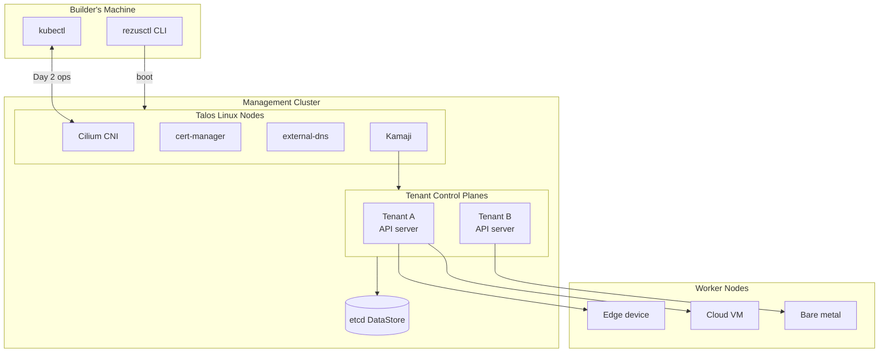

# Architecture

RezusCloud has a single binary (`rezusctl`) that handles the full lifecycle of your Personal Cloud: provisioning infrastructure, bootstrapping nodes, installing platform components, and managing multi-cluster fleets.

**rezusctl builds clusters. kubectl manages them.**

## How it fits together

## Management cluster

The management cluster is the control plane for your entire Personal Cloud. It runs on [Talos Linux](https://www.talos.dev/) nodes that `rezusctl boot` provisions and configures.

### Runtime components

| Component | What it does |
|---|---|
| Cilium | Container networking, network policy, and Gateway API ingress |
| cert-manager | TLS certificate lifecycle (automatic issuance and renewal) |
| external-dns | Keeps DNS records in sync with your platform services |
| Kamaji | Runs tenant Kubernetes control planes as pods |
| Dapr | Building block APIs for platform services |

## Design principles

1. **No Terraform dependency.** Cloud provisioning uses native Go SDK calls, not a separate IaC toolchain.
2. **CRD-based reconciliation.** Two custom resources (`RezusCloudConfig` and `RezusTenantConfig`) are the source of truth. Changes flow through Kubernetes reconciliation, not scripts.
3. **Kubernetes-native Day 2.** No custom REST API. The WebUI is a static SPA that talks directly to the Kubernetes API server.
4. **Docker-first development.** Test the full orchestration locally before touching real infrastructure.
5. **Idempotent operations.** Running `rezusctl boot` twice produces the same result as running it once.

## Tenant clusters

For isolation between workloads or teams, RezusCloud uses [Kamaji](https://kamaji.clastix.io/) to run separate Kubernetes control planes as pods inside the management cluster. Each tenant gets its own API server, scheduler, controller manager, and etcd. See [Multi-Cluster](/docs/concepts/multi-cluster) for details.

<!-- source: rezusctl:docs/architecture.md -->
