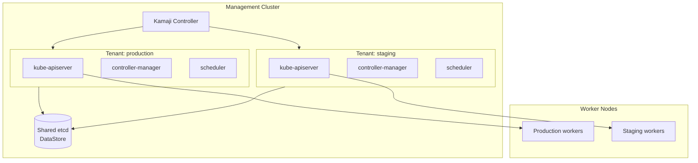
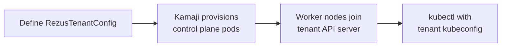

# Multi-Cluster

RezusCloud can run multiple independent Kubernetes clusters from a single management cluster. Each tenant cluster has its own API server, scheduler, controller manager, and etcd, all running as pods inside the management cluster. Worker nodes join from anywhere: edge devices, cloud VMs, or bare metal servers.

This is useful when you need isolation between environments (production, staging, development) or between teams, without maintaining separate physical infrastructure for each.

## How it works

RezusCloud uses [Kamaji](https://kamaji.clastix.io/) to host tenant control planes as pods. The management cluster provides the compute for these control planes, while worker nodes connect to their assigned tenant's API server.



## Tenant lifecycle

Setting up a new tenant is a single CRD application:

```bash
# Apply the tenant configuration
kubectl apply -f tenant-production.yaml
```

```yaml
apiVersion: rezuscloud.io/v1alpha1
kind: RezusTenantConfig
metadata:
  name: production
spec:
  controlPlane:
    version: "1.30"
    replicas: 1
  networking:
    podCIDR: "10.200.0.0/16"
    serviceCIDR: "10.100.0.0/16"
```



## Benefits

- **Isolation**: each tenant has its own API server and etcd. A misconfiguration in one tenant cannot affect another
- **Density**: control planes share management cluster compute instead of requiring dedicated hardware
- **Flexibility**: workers can be anywhere: bare metal, cloud VMs, or edge devices
- **Simplicity**: one management cluster to monitor and maintain, many tenant clusters to use

<!-- source: rezusctl:docs/multi-cluster.md -->
