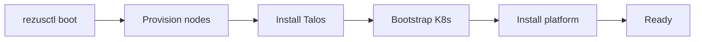

# Getting Started

Get RezusCloud running in minutes. This guide walks you through installing the CLI, bootstrapping your first cluster, and deploying a workload.

## Prerequisites

| Requirement | Version | Check |
|---|---|---|
| Go | 1.26+ | `go version` |
| Talos Linux | 1.12+ | — |
| Helm | 3.14+ | `helm version` |

For OCI cloud deployments, you also need:

| Requirement | Purpose |
|---|---|
| OCI account | Oracle Cloud Infrastructure access |
| `~/.oci/config` | OCI SDK credentials |
| Cloudflare API token | DNS management |

## Step 1: Install the CLI

Download `rezusctl` from [GitHub releases](https://github.com/rezuscloud/rezusctl/releases):

```bash
# Linux (amd64)
curl -sL https://github.com/rezuscloud/rezusctl/releases/latest/download/rezusctl_linux_amd64.tar.gz | tar xz
sudo mv rezusctl /usr/local/bin/

# macOS (arm64)
curl -sL https://github.com/rezuscloud/rezusctl/releases/latest/download/rezusctl_darwin_arm64.tar.gz | tar xz
```

Verify the installation:

```bash
rezusctl version
```

## Step 2: Create a config file

Create `rezuscloud-config.yaml` describing your infrastructure:

```yaml
apiVersion: rezuscloud.io/v1alpha1
kind: RezusCloudConfig
metadata:
  name: my-cloud
spec:
  # Define your Machine Rooms
  machineRooms:
    - name: home
      provider: baremetal
      nodes:
        - address: 192.168.1.100
    - name: cloud
      provider: oci
      region: eu-frankfurt-1
```

## Step 3: Bootstrap the cluster

One command provisions infrastructure and bootstraps the management cluster:

```bash
rezusctl boot --config rezuscloud-config.yaml
```

The boot command is idempotent. Re-running it applies diffs: creates missing resources, updates changed ones, and skips everything that is already correct.



## Step 4: Verify

```bash
# Check platform status
rezusctl status

# Your kubeconfig is ready — use kubectl
kubectl get nodes
```

## What's next?

- [Architecture](/docs/concepts/architecture): understand how the platform components fit together
- [Multi-Cluster](/docs/concepts/multi-cluster): run multiple Kubernetes control planes for isolation
- [CLI Reference](/docs/reference/cli): all commands and flags

<!-- source: rezusctl:docs/getting-started.md -->
