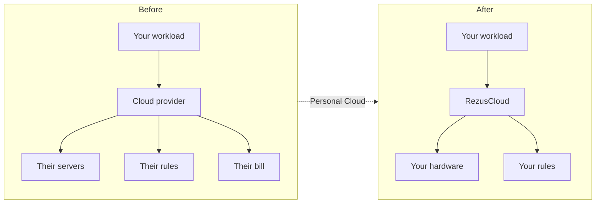
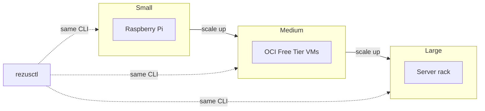

# What is RezusCloud?

RezusCloud is a free, fully open source platform that gives you your own cloud. Deploy workloads across edge devices, cloud VMs, and bare metal servers with the same simplicity as a managed cloud provider, but without the bill.

## The Personal Cloud

The PC made computing personal: you owned the machine instead of renting mainframe time. RezusCloud does the same for cloud infrastructure. You own the hardware, the data, and the computation. No landlord, no lease, no eviction.

Personal means self-managed, not single-user. An enterprise with 200 engineers can run a Personal Cloud. Their Machine Room might be a rack in a data center instead of a Raspberry Pi on a shelf, but it is still theirs.

## Key concepts

### Machine Room

The physical infrastructure you control. A Raspberry Pi at home, a free OCI VM, a Hetzner dedicated server, or a rack in a data center. You plug it in, RezusCloud handles the rest.

### Golden Path

A tested, fully featured default configuration that covers 90% of real-world use cases. You deploy workloads on top of Kubernetes without needing to operate Kubernetes itself.

### Builder

Anyone who uses the platform: a solo developer, an ML engineer, an ops lead, or a platform team. The person who pushes to git.

## Why own your cloud

| Problem | Rented cloud | Personal Cloud |
|---|---|---|
| Traffic costs | Per-byte egress tolls | Data moves through encrypted tunnels between your nodes |
| Denial of wallet | Per-request billing, attackers inflate your bill | No per-request billing. No bill to inflate |
| Egress fees | Provider charges for accessing your own files | Data stays on your disks |
| Pricing changes | Vendor changes costs at any time | Hardware depreciation or a flat lease are predictable for years |
| Idle resources | 30% of cloud spend is pure waste | Hardware at any utilization is free headroom |
| Vendor lock-in | Proprietary APIs, migration pain | Every component is open source and replaceable |

## Start with a Pi, scale to a rack

Same platform, same git push, same operational simplicity. No traffic costs, no egress fees, no API burst surprises, no pricing policy changes, no idle resource waste, no lock-in.

## What you get

- **Multi-site edge computing**: connect nodes across locations with encrypted tunnels
- **Distributed workloads**: schedule containers across heterogeneous hardware
- **GPU scheduling**: assign GPU resources to AI and ML workloads
- **Access controls**: role-based access for teams of any size
- **Audit trails**: full visibility into who did what and when
- **Zero egress fees**: data moves freely between your nodes

<!-- source: platform-website:docs/getting-started/what-is-rezuscloud.md -->
